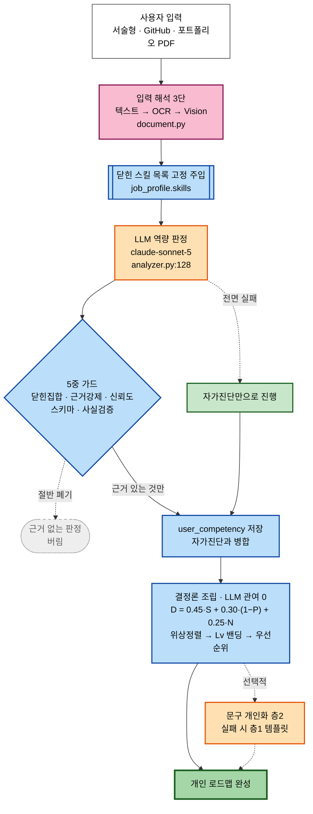
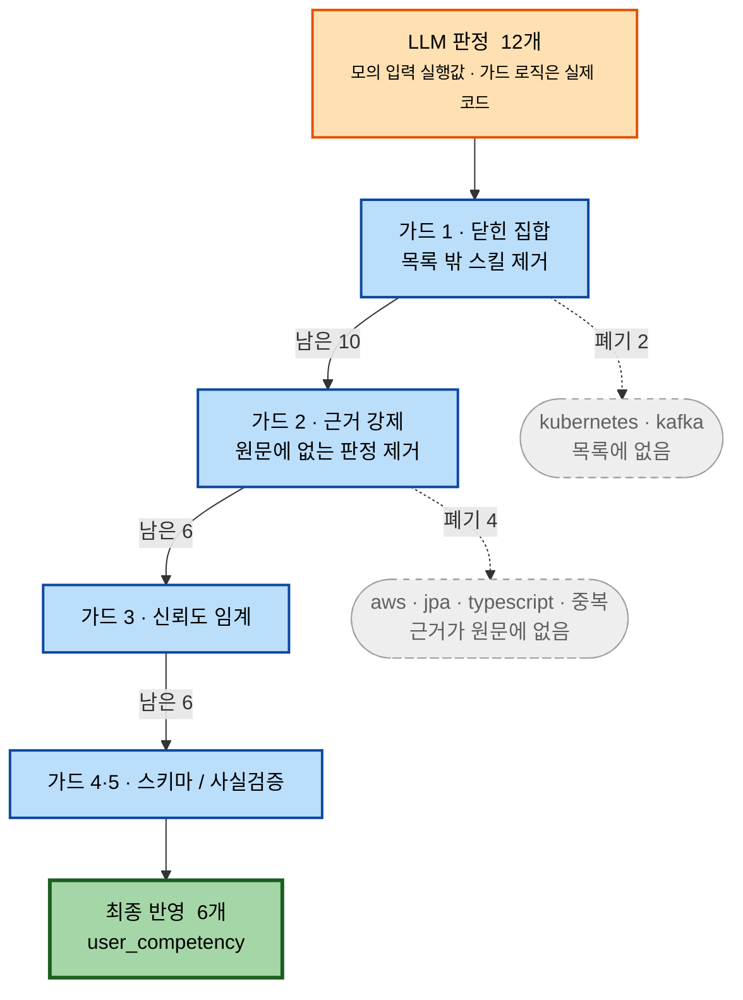
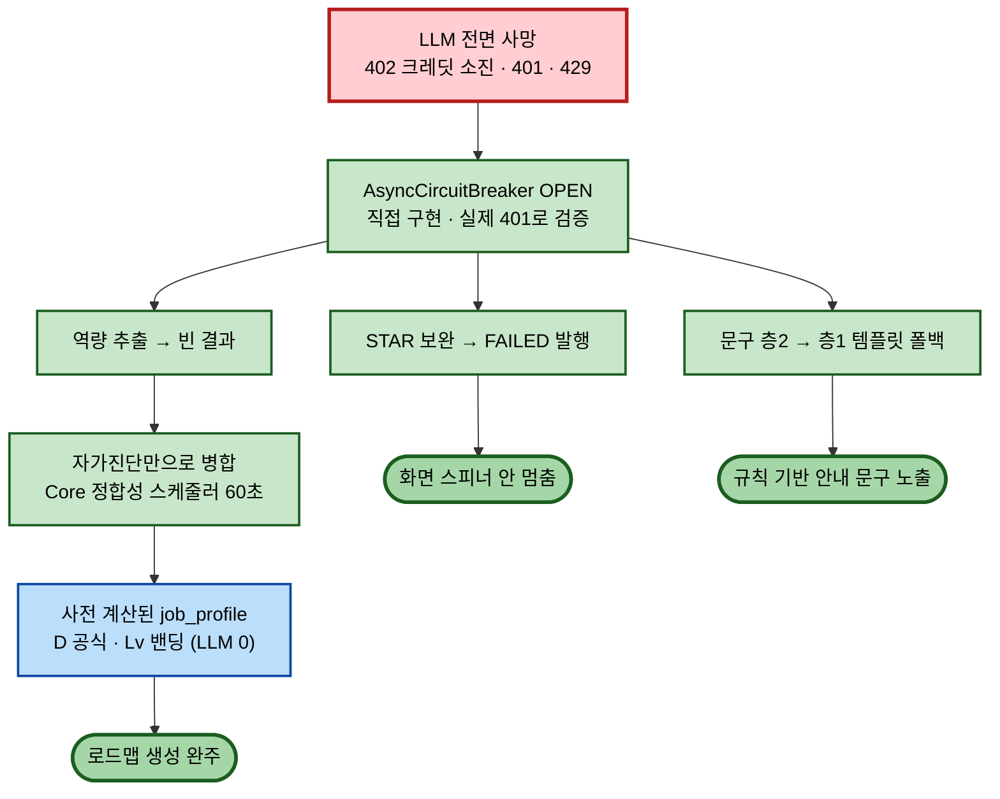

# AI 파이프라인 — 무엇이 걸러지는가

MYiTH Worker의 AI 사용 흐름. **핵심은 "무엇이 폐기되고, AI 없이도 어떻게 완주하는가"다.**
LLM은 문구·근거 판정만 하고, 로드맵 구조(레벨·순서)는 결정론(공식)이 정한다(C-2).
각 노드의 구현 위치(`파일:줄`)는 판독성을 위해 그림에서 빼고 문서 하단 [근거 목록](#근거-파일줄)에 모았다.

## 그림 1 — 전체 흐름

3초 안에 읽히게 했다 — 주황(LLM)은 **판정만** 하고, 파랑(공식)이 **구조를 정한다.** 상세 분기는 그림 2·3에 있다.

## 색 규칙
- 🟧 **주황 = LLM 판정** — 역량 판정·문구·Vision. 여기만 AI가 관여한다.
- 🟦 **파랑 = 결정론** — 공식·규칙. **로드맵 구조(레벨·순서)엔 LLM이 없다(C-2)**
- 🌸 **분홍 = 입력 해석 3단** — 텍스트→OCR→Vision 혼합
- ⬜ **회색 점선 = 폐기 경로** — 가드가 걸러내는 것
- 🟩 **초록 = 폴백/완성** — AI가 죽어도 완주한다(C-3)

---

## 그림 2 — 가드 깔때기 (LLM을 믿지 않는다)

LLM 판정 12개가 가드를 통과하며 6개로 줄어든다. 숫자는 [guard-trace-sample.md](guard-trace-sample.md)
**§1 모의 실행값**(입력만 모의, 가드 로직은 실측)이며, 그림 안 첫 노드(LLM 판정)에도 표기했다 — 발표엔 §2 실측으로 교체한다.

> **12개 중 6개 폐기.** 이 그림 하나가 "LLM 출력을 그대로 믿지 않는다"를 증명한다.
> STAR 보완(H-2)엔 별도 사실검증 가드가 하나 더 있다([star_enhance.py](../app/llm/star_enhance.py) `has_fabrication`).

---

## 그림 3 — 장애 주입: LLM이 전면 사망해도 서비스는 산다

선불 $5 소진(402)·401·429로 LLM이 죽으면 서킷브레이커가 열리고, **초록 경로만으로 로드맵이 완성**된다.

> **AI가 죽어도 로드맵·퀘스트·문구가 전부 나온다.** 401 실호출로 세 경로(역량 []·STAR FAILED·문구 층1)
> 모두 완주 검증 완료(2026-07-29).

## 근거 (파일:줄)
- 3단 문서 파싱: [document.py:98](../app/competency/document.py#L98)
- OCR(비-LLM, 자격증명 없으면 스킵 — 데모 범위 밖): [ocr.py](../app/competency/ocr.py)
- Vision 키워드: [vision.py:41](../app/competency/vision.py#L41)
- GitHub 요약: [github.py](../app/competency/github.py)
- 역량 판정(닫힌 분류) + 가드 5중: [analyzer.py:128](../app/competency/analyzer.py#L128)
- D 공식(결정론): [scoring.py](../app/pipeline/scoring.py) · 값은 job_profile에 사전계산
- 층2 문구 개인화: [guidance.py:128](../app/pipeline/guidance.py#L128)
- STAR 보완: [star_enhance.py:124](../app/llm/star_enhance.py#L124)
- 공급자(서킷브레이커·구조화 출력·폴백): [provider.py](../app/llm/provider.py)

> **과장 금지:** F(직무 프로필 빌드) 오케스트레이터는 런타임 미실행 — D·레벨·선후관계는
> 시드 job_profile에 사전계산돼 있고 Core가 조립 시 읽는다. 위 "결정론 조립"은 그 사전계산
> 공식(scoring.py, 테스트됨)과 조립을 가리킨다.
